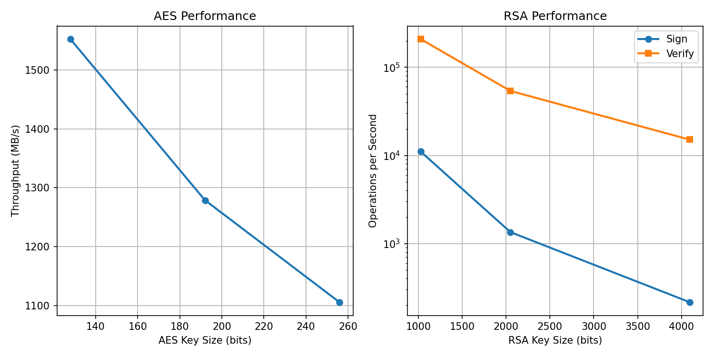

## Task 1: ECB vs CBC Encryption

### Original Image


### ECB Encrypted


ECB encrypts each block independently. Identical plaintext blocks produce identical ciphertext blocks, so you can still see the mustang outline. This demonstrates why ECB is insecure for images.

### Original Image


### CBC Encrypted


CBC XORs each block with the previous ciphertext before encrypting. The result looks completely random - no visible patterns. This is secure.

## Task 2: CBC Bit-Flipping Attack

**Output:**
Saved: ecb_encrypted.bmp and cbc_encrypted.bmp
Task 2: CBC Bit-Flipping Attack Demo
Before attack: verify() = False
After attack:  verify() = True
Attack worked! Got admin access.

**How it works:**
- Flipping a bit in ciphertext block N scrambles plaintext block N
- But it flips the same bit in plaintext block N+1
- I sent "AAAA..." as input and flipped bits to change it to ";admin=true;"

**Why this is possible:**
CBC has no integrity check. An attacker can modify ciphertext without knowing the key.

**How to prevent:**
Use authenticated encryption like AES-GCM or add HMAC to verify the ciphertext hasn't been tampered with.

## Task 3: Performance Results



**AES Performance:**
- AES-128: 1,552 MB/s
- AES-192: 1,279 MB/s
- AES-256: 1,106 MB/s

**RSA Performance (Sign operations):**
- RSA-1024: 11,055 ops/s
- RSA-2048: 1,348 ops/s
- RSA-4096: 215 ops/s

## Questions

**Question 1: What do you observe in the encrypted images? What causes this?**

In the ECB encrypted image, you can still see the outline of the mustang. This happens because ECB encrypts each 16-byte block identically - if two blocks have the same plaintext, they produce the same ciphertext. Areas with the same color in the original image have identical blocks, so they stay identical after encryption, preserving the visual pattern. The CBC encrypted image looks completely random because each block is XORed with the previous ciphertext before encryption, so identical plaintext blocks produce different ciphertext blocks.

**Question 2: Why is the bit-flipping attack possible? What does the scheme need to prevent it?**

The attack works because CBC mode has no integrity protection. When you flip a bit in ciphertext block N, it scrambles plaintext block N (making it unreadable), but predictably flips the same bit position in plaintext block N+1. An attacker can calculate exactly which bits to flip to inject desired text without knowing the encryption key. To prevent this, use authenticated encryption modes like AES-GCM or ChaCha20-Poly1305, which include a MAC that detects any tampering. Alternatively, add HMAC to verify ciphertext integrity before decryption.

**Question 3: How do the AES and RSA results compare?**

AES is dramatically faster than RSA - over 1000x faster. AES-128 processes 1,552 MB/s while RSA-1024 only does 11,055 sign operations per second. As key sizes increase, both algorithms slow down, but RSA degrades much more severely (RSA-4096 is only 215 ops/s). This massive performance difference is why real-world systems use hybrid encryption: RSA for key exchange and AES for encrypting actual data.

## Code
```python
from Crypto.Cipher import AES
from Crypto.Random import get_random_bytes

BLOCK_SIZE = 16

def pkcs7_pad(data):
    pad_length = BLOCK_SIZE - (len(data) % BLOCK_SIZE)
    padding = bytes([pad_length]) * pad_length
    return data + padding

def pkcs7_unpad(data):
    pad_length = data[-1]
    return data[:-pad_length]

def encrypt_one_block(key, block):
    cipher = AES.new(key, AES.MODE_ECB)
    return cipher.encrypt(block)

def decrypt_one_block(key, block):
    cipher = AES.new(key, AES.MODE_ECB)
    return cipher.decrypt(block)

def ecb_encrypt(key, plaintext):
    padded = pkcs7_pad(plaintext)
    result = b""
    for i in range(0, len(padded), BLOCK_SIZE):
        block = padded[i:i+BLOCK_SIZE]
        encrypted_block = encrypt_one_block(key, block)
        result += encrypted_block
    return result

def ecb_decrypt(key, ciphertext):
    result = b""
    for i in range(0, len(ciphertext), BLOCK_SIZE):
        block = ciphertext[i:i+BLOCK_SIZE]
        decrypted_block = decrypt_one_block(key, block)
        result += decrypted_block
    return pkcs7_unpad(result)

def cbc_encrypt(key, iv, plaintext):
    padded = pkcs7_pad(plaintext)
    result = b""
    previous = iv
    for i in range(0, len(padded), BLOCK_SIZE):
        block = padded[i:i+BLOCK_SIZE]
        xored = bytes(a ^ b for a, b in zip(block, previous))
        encrypted = encrypt_one_block(key, xored)
        result += encrypted
        previous = encrypted
    return result

def cbc_decrypt(key, iv, ciphertext):
    result = b""
    previous = iv
    for i in range(0, len(ciphertext), BLOCK_SIZE):
        block = ciphertext[i:i+BLOCK_SIZE]
        decrypted = decrypt_one_block(key, block)
        plaintext_block = bytes(a ^ b for a, b in zip(decrypted, previous))
        result += plaintext_block
        previous = block
    return pkcs7_unpad(result)

SERVER_KEY = get_random_bytes(16)
SERVER_IV = get_random_bytes(16)

def submit(userdata):
    safe_input = userdata.replace(";", "%3B").replace("=", "%3D")
    full_string = "userid=456;userdata=" + safe_input + ";session-id=31337"
    return cbc_encrypt(SERVER_KEY, SERVER_IV, full_string.encode())

def verify(ciphertext):
    try:
        plaintext = cbc_decrypt(SERVER_KEY, SERVER_IV, ciphertext)
        text = plaintext.decode('utf-8', errors='ignore')
        return ";admin=true;" in text
    except:
        return False

def bitflip_attack():
    prefix = "userid=456;userdata="
    prefix_len = len(prefix)
    padding_needed = BLOCK_SIZE - (prefix_len % BLOCK_SIZE)
    userdata = "A" * (padding_needed + BLOCK_SIZE)
    original_ct = submit(userdata)
    
    print("Before attack: verify() =", verify(original_ct))
    
    ct_list = list(original_ct)
    target_block_num = (prefix_len + padding_needed) // BLOCK_SIZE
    previous_block_start = (target_block_num - 1) * BLOCK_SIZE
    injection = b";admin=true;"
    
    for i in range(len(injection)):
        ct_list[previous_block_start + i] ^= ord('A') ^ injection[i]
    
    modified_ct = bytes(ct_list)
    print("After attack:  verify() =", verify(modified_ct))
    return verify(modified_ct)

def encrypt_image(image_filename):
    with open(image_filename, 'rb') as f:
        data = f.read()
    
    header = data[:54]
    image_data = data[54:]
    key = get_random_bytes(16)
    iv = get_random_bytes(16)
    
    ecb_result = ecb_encrypt(key, image_data)
    with open('ecb_encrypted.bmp', 'wb') as f:
        f.write(header + ecb_result[:len(image_data)])
    
    cbc_result = cbc_encrypt(key, iv, image_data)
    with open('cbc_encrypted.bmp', 'wb') as f:
        f.write(header + cbc_result[:len(image_data)])
    
    print("Saved: ecb_encrypted.bmp and cbc_encrypted.bmp")

if __name__ == "__main__":
    encrypt_image('mustang.bmp')
    
    print("\n" + "=" * 50)
    print("Task 2: CBC Bit-Flipping Attack Demo")
    print("=" * 50)
    success = bitflip_attack()
    if success:
        print("\n✓ Attack worked! Got admin access.")
    else:
        print("\n Attack failed.")
