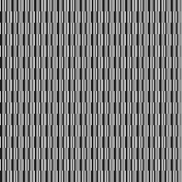

# Block Ciphers Assignment
Emanuel Gonzalez

## Task 1: ECB vs CBC Encryption

### ECB Pattern Leak

ECB encrypts each block the same way. Same plaintext block = same ciphertext block. You can still see the checkerboard pattern after encryption. This is why ECB is insecure for images.

### Avalanche Effect

Changing 1 bit in plaintext changes about 50% of the ciphertext bits. This shows AES has good diffusion.

## Task 2: CBC Bit-Flipping Attack

**Output:**

**How it works:**
- Flipping a bit in ciphertext block N scrambles plaintext block N
- But it flips the same bit in plaintext block N+1
- I sent "AAAA..." as input and flipped bits to change it to ";admin=true;"

**Why this is possible:**
CBC has no integrity check. An attacker can modify ciphertext without knowing the key.

**How to prevent:**
Use authenticated encryption like AES-GCM or add HMAC to verify the ciphertext hasn't been tampered with.

## Task 3: Performance Results

[Add your OpenSSL speed test results and graphs here]