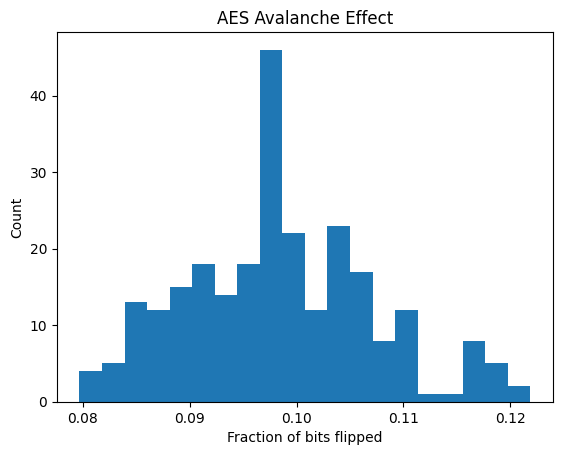

# Module 2 — Block Ciphers (CSC-321)  
**Emanuel Gonzalez**

---

## 1) ECB pattern leak

**Caption:** ECB encrypts each 16-byte block independently. Identical plaintext blocks → identical ciphertext blocks, so the tile structure remains visible. This demonstrates why ECB should not be used for images or other structured data.

---

## 2) Avalanche effect
Histogram of ciphertext bit-flips when flipping one plaintext bit:  

**Caption:** Random single-bit flips in the plaintext cause ≈50% of ciphertext bits to change on average, demonstrating strong diffusion.

---

## 3) CBC bit-flip exploit (Task 2)
I ran the provided demo which output:

